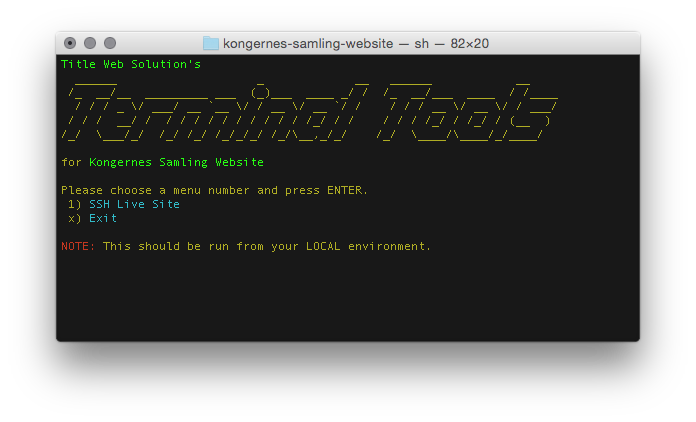
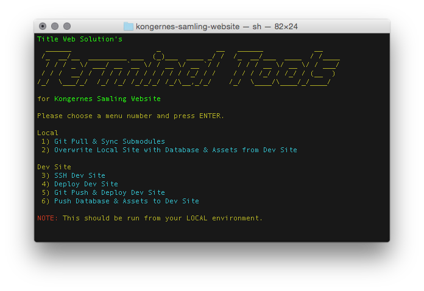

# Terminal Tools

_by Title Web Solutions / Anselm Christophersen, 2014_

_Terminal Tools_ is a menu based set of easy-to-use command line scripts for working on    
**Web Development Projects**.    
_Terminal Tools_ is easy to extend (through modules) and 
amend (through configuration) - both through global project settings, and environment specific settings 
(e.g. Live/Test/Dev servers), all done through one `yml` configuration file.

## Configuration example

A standard config will be set up for you on install. Here's an example of how this might look:

	Projectname: "My Project"
	Environments:
		Live:
			Host: "myserver.com"
			Sshuser: "myuser"
			Repodir: "/var/git-repos/mysite"
			Sshport: ""
			Composerpath: ""
			PhpPath: ""
		Test:
		#here goes data for a test server
		Dev:
		#here goes data for dev server - you can add as many servers as you want
	
	#this is the menu - you can configure it exactly like you like
	Menu:
		Item1:
			Title: SSH Live Site
			Command: "ttools-core/local/ssh.sh Live"
		Item2:
			Title: My specific command
			Command: "my-scripts/my-specific-command.sh"

## Installation

Run the following command. This module will be added to your project as a sub module.

	git submodule add git://github.com/titledk/ttools-core.git ttools/core;./ttools/core/_install.sh;

## How To Use

_Terminal Tools_ will be installed in your repository root.    
Once installed, run `./ttools`, and you'll be presented with a list of options.    

The `ttools-core` module contains the very basics - libraries, menu, and a means
to easily ssh into your specific servers.    
Everything else can be added via modules.

## Modules

The following modules are available:

* [Git Helpers](https://github.com/titledk/ttools-githelpers): 
Pull and push - and git based deployment to your environments
* [Wordpress Sync](https://github.com/CPHCloud/ttools-sitesync-wordpress): syncing database and assets from 
Wordpress sites - for development and backup

Planned:

* **SilverStripe Sync**: syncing database and assets from SilverStripe sites - for development and backup
* **SilverStripe Deployment**: Git-based deployment like in our [deployment module](https://github.com/titledk/silverstripe-deployment) 

Below you see _Terminal Tools_ configured with
[Git Helpers](https://github.com/titledk/ttools-githelpers)
and [Wordpress Sync](https://github.com/CPHCloud/ttools-sitesync-wordpress).

## Roadmap/Ideas/Plans

This is some of the functionality we're planning for `ttools-core`.    
There is no due date, so if you'd like one of these features, you can sponsor
us to implement it, or create it yourself and send a pull request.
Either way, make sure to get in touch with us through <http://title.dk> for this.

### Split environments out to own module

Mostly only web projects have the need to configure environments. By moving this out, Terminal Tools
will be open for a broader spread of projects.

When this is done, we should also:

* Introduce [semantic versioning](http://semver.org) at least on core    
_So things don't just break for people who use this_
* Make installation 1-liners:
  * Wep project
  * Normal project
  * ect

### Adding version/branch/tag number

e.g.:

	v. master/#e185ff8 (2014-07-23)
	v. 1.0/#e185ff8 (2014-07-23)
	v. dev/#e185ff8 (2014-07-23)

### Module default configurations

While the strength of _Terminal Tools_ is the easy configurable menu,
sometimes you just want to go with the defaults, as it's just easier.

So it would make sense if modules could have default configurations that
could just plug in to the menu.

### Dependency management

The more modules that will exist, the more there'll be a need
for dependency management. At the moment no big issue,
but good to think about.

### Make the default environment configurable

Either via `yml`, you just by calling `./ttools ENV`, e.g. `./ttools Dev`

This could allow menus like this:

Current menu:

	Please choose a menu number and press ENTER.
	 1) Git Pull & Sync Submodules
	 2) Overwrite Local Site with Database & Assets from Dev Site
	 3) Deploy Dev Site
	 4) SSH Dev Site

Menu with environment configuration:

	Please choose a menu number and press ENTER.
	 1) Git Pull & Sync Submodules
	 2) Overwrite Local Site with Database & Assets from Dev Site
	 	2a) Live site, 2b) Test site
	 3) Deploy Dev Site
	 	3a) Live site, 3b) Test site
	 4) SSH Dev Site
	 	4a) Live site, 4b) Test site

### Menu options

Define a sub menu API, so scripts can define which options they can be called with,
which would then be visible in the menu.

This idea is a little along "Make the default environment configurable", but for other options.

e.g.

Current menu:

	 13) git add all and commit 
	 14) git add all commit and push 
	 15) git add all commit and push (+Live deploy) 
	 16) git add all commit and push (+Test deploy) 
	 17) git add all commit and push (+Dev deploy) 

Menu with options:

	 13) git add all and commit
	 	13a) & Push
	 	13b) & Push & Deploy to Dev Site
	 		13ba) Live Site, 13bb) Test Site

